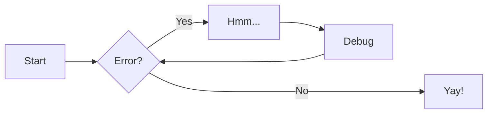
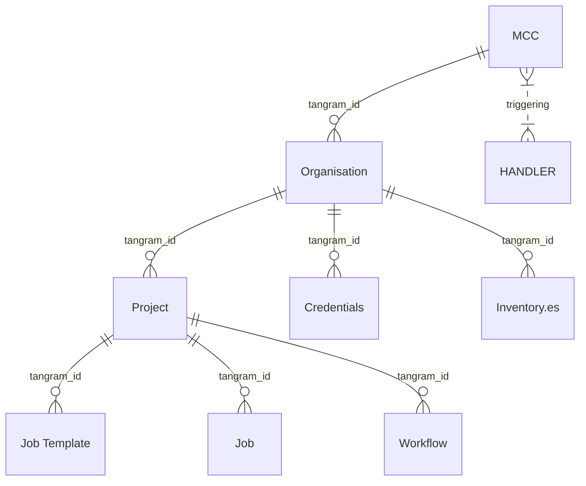
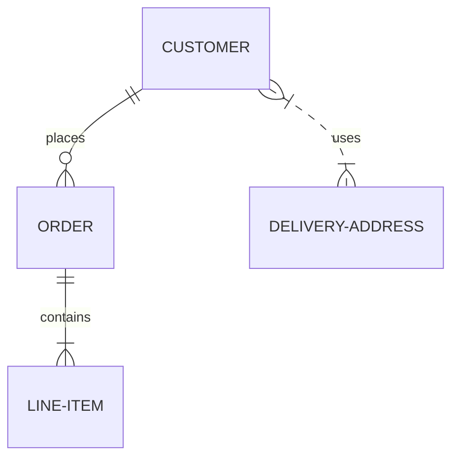

# Mermaid

``` mermaid
graph LR
  A[Start] --> B{Error?};
  B -->|Yes| C[Hmm...];
  C --> D[Debug];
  D --> B;
  B ---->|No| E[Yay!];
```

```mermaid
erDiagram
    MCC ||--o{ Organisation : tangram_id
    Organisation ||--o{ Project : tangram_id
    Organisation ||--o{ Credentials : tangram_id
    Organisation ||--o{ "Inventory.es" : tangram_id 
    Project ||--o{ "Job Template" : tangram_id
    Project ||--o{ Job : tangram_id
    Project ||--o{ Workflow : tangram_id 
    MCC }|..|{ HANDLER : triggering
```

---

```mermaid
erDiagram
    CUSTOMER ||--o{ ORDER : places
    ORDER ||--|{ LINE-ITEM : contains
    CUSTOMER }|..|{ DELIVERY-ADDRESS : uses
```