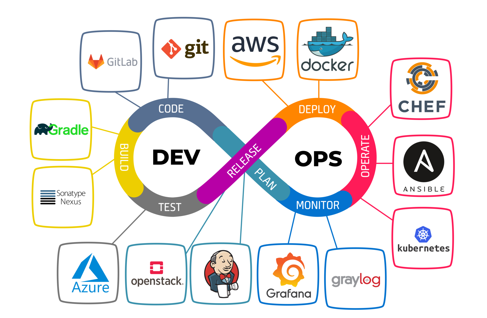

## About

DevOps is the combination of cultural philosophies, practices, and tools that increases an organization's ability to deliver applications and services at high velocity: evolving and improving products at a faster pace than organizations using traditional software development and infrastructure management processes.

