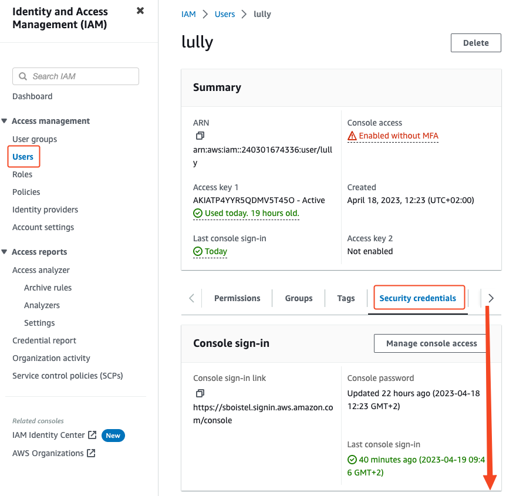
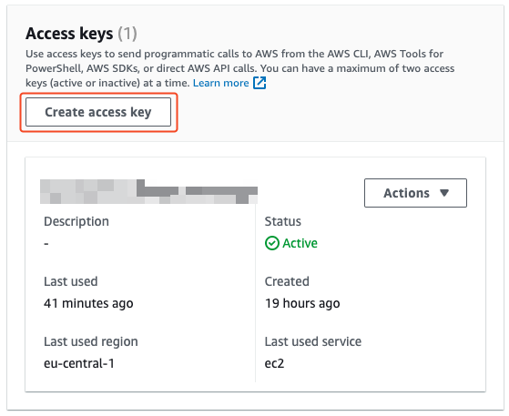
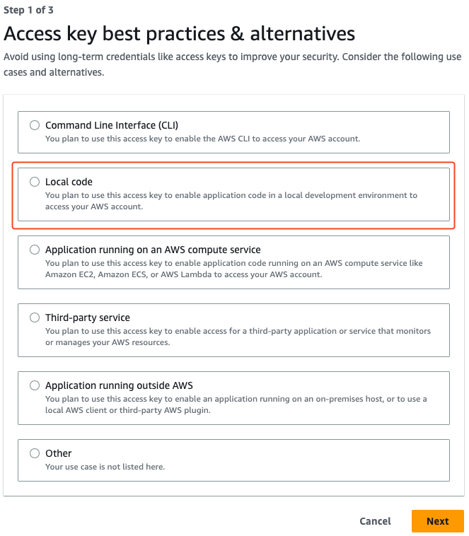
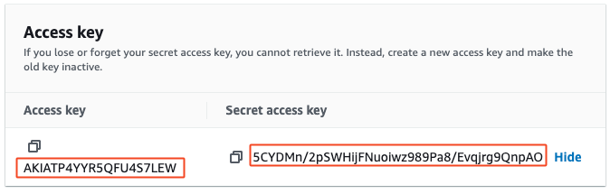
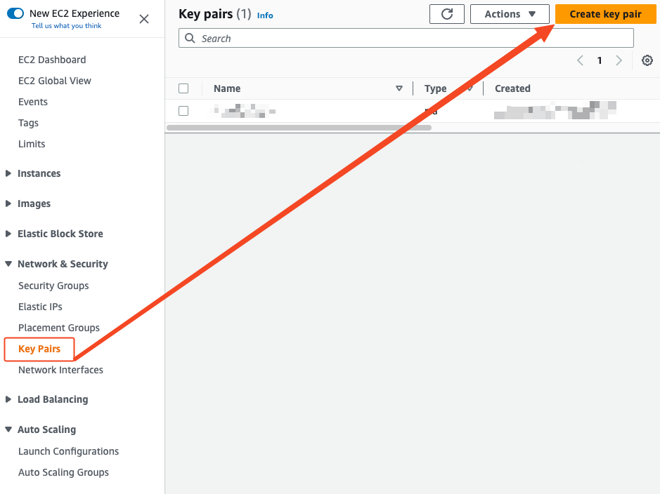
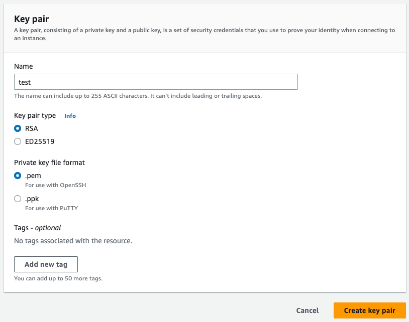

# Providers

## AWS

## Prerequisites

### IAM

Keys :







!!! WARNING

    Copy somewhere your keys



Generate keys :





Create instance :

Example `main.tf`

- key name = key pairs

```terraform
provider "aws" {
  region     = "eu-central-1"
  access_key = "*************"
  secret_key = "*******************"
}

resource "aws_instance" "test_ec2" {
  ami           = "ami-0ec7f9846da6b0f61" # Ubuntu Server 22.04 LTS (HVM)
  instance_type = "t2.micro"
  key_name      = "***********"

  tags = {
    Name = "test01"
  }
}
```
