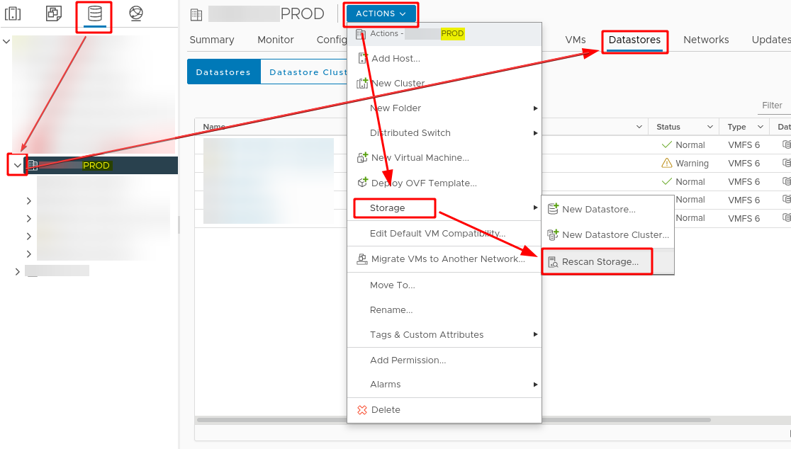

# VMware
Created Tuesday 25 January 2022

Rescan Storage
==============
How to rescan storage ?



USB Datastore
=============
How to add an USB hard drive as Datastore ?

Disabling usb arbitrator service
--------------------------------

### Stopping :

```bash
/etc/init.d/usbarbitrator stop
```

### Disabling :

```bash
chkconfig usbarbitrator off
```

Labeling
--------

```bash
partedUtil mklabel /dev/disks/mpx.vmhba32:C0:T0:L0 gpt
```

### Get the partition table

:warning: This command will bring you a number :

```bash
eval expr $(partedUtil getptbl /dev/disks/mpx.vmhba32:C0:T0:L0 | tail -1 | awk '{print $1 " \\* " $2 " \\* " $3}') - 1
```

Dont forget to fill the number found :

```bash
partedUtil setptbl /dev/disks/mpx.vmhba32:C0:T0:L0 gpt "1 2048 ${NUMBER} AA31E02A400F11DB9590000C2911D1B8 0"
```

### Last step

```bash
vmkfstools -C vmfs6 -S USB-Datastore /dev/disks/mpx.vmhba32:C0:T0:L0:1
```

## License

### Removing License

> rm -r /etc/vmware/license.cfg

### Get a new trial license

> cp /etc/vmware/.#license.cfg /etc/vmware/license.cfg

### Restarting VPXA

> /etc/init.d/vpxa restart