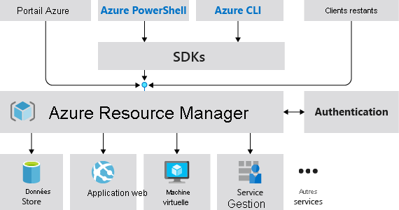

# Microsoft Azure Administrator

Prérequis pour les administrateurs Azure

## Blob Storage

Azure Blob Storage is **Microsoft's object storage solution for the cloud**.
Blob Storage is **optimized** for storing massive amounts of unstructured data.
Unstructured data is data that doesn't adhere to a particular data model or definition, such as text or binary data.

Blob Storage is designed for:

- Serving images or documents directly to a browser.
- Storing files for distributed access.
- Streaming video and audio.
- Writing to log files.
- Storing data for backup and restore, disaster recovery, and archiving.
- Storing data for analysis by an on-premises or Azure-hosted service.

## Azure Command-Line Interface (CLI)

> https://learn.microsoft.com/en-us/cli/azure/

## Azure PowerShell

> https://learn.microsoft.com/en-us/powershell/module/az.compute/new-azvm?view=azps-9.4.0

The **New-AzVM** cmdlet creates a virtual machine in Azure.This cmdlet takes a virtual machine object as input.The **New-AzVM** cmdlet will create a new storage account for boot diagnostics if one does not already exist.
  
Use the **[New-AzVMConfig](https://learn.microsoft.com/en-us/powershell/module/az.compute/new-azvmconfig)** cmdlet to create a virtual machine object.
Then use the following cmdlets to set different properties of the virtual machine object:

- **[Add-AzVMNetworkInterface](https://learn.microsoft.com/en-us/powershell/module/az.compute/add-azvmnetworkinterface)** to set the network profile.
- **[Set-AzVMOperatingSystem](https://learn.microsoft.com/en-us/powershell/module/az.compute/set-azvmoperatingsystem)** to set the OS profile.
- **[Set-AzVMSourceImage](https://learn.microsoft.com/en-us/powershell/module/az.compute/set-azvmsourceimage)** to set the source image.
- **[Set-AzVMOSDisk](https://learn.microsoft.com/en-us/powershell/module/az.compute/set-azvmosdisk)** to set the OS disk(storage profile).
- **[Get-AzComputeResourceSku](https://learn.microsoft.com/en-us/powershell/module/az.compute/get-azcomputeresourcesku)** can also be used to find out available virtual machine sizes for your subscription and region.

The `SimpleParameterSet` provides a convenient method to create a VM by making common VM creation arguments optional.

See [Quickstart: Create a Windows virtual machine in Azure with PowerShell](https://learn.microsoft.com/en-us/azure/virtual-machines/windows/quick-create-powershell) for tutorial.

Syntax :

```powershell
New-AzVM
   [[-ResourceGroupName] <String>]
   [[-Location] <String>]
   [-EdgeZone <String>]
   [[-Zone] <String[]>]
   [-PublicIpSku <String>]
   -Name <String>
   -Credential <PSCredential>
   [-NetworkInterfaceDeleteOption <String>]
   [-VirtualNetworkName <String>]
   [-AddressPrefix <String>]
   [-SubnetName <String>]
   [-SubnetAddressPrefix <String>]
   [-PublicIpAddressName <String>]
   [-DomainNameLabel <String>]
   [-AllocationMethod <String>]
   [-SecurityGroupName <String>]
   [-OpenPorts <Int32[]>]
   [-Image <String>]
   [-Size <String>]
   [-AvailabilitySetName <String>]
   [-SystemAssignedIdentity]
   [-UserAssignedIdentity <String>]
   [-AsJob]
   [-OSDiskDeleteOption <String>]
   [-DataDiskSizeInGb <Int32[]>]
   [-DataDiskDeleteOption <String>]
   [-EnableUltraSSD]
   [-ProximityPlacementGroupId <String>]
   [-HostId <String>]
   [-VmssId <String>]
   [-Priority <String>]
   [-EvictionPolicy <String>]
   [-MaxPrice <Double>]
   [-EncryptionAtHost]
   [-HostGroupId <String>]
   [-SshKeyName <String>]
   [-GenerateSshKey]
   [-CapacityReservationGroupId <String>]
   [-UserData <String>]
   [-ImageReferenceId <String>]
   [-PlatformFaultDomain <Int32>]
   [-HibernationEnabled]
   [-vCPUCountAvailable <Int32>]
   [-vCPUCountPerCore <Int32>]
   [-DiskControllerType <String>]
   [-DefaultProfile <IAzureContextContainer>]
   [-WhatIf]
   [-Confirm]
   [<CommonParameters>]
```

### Example

#### Create a virtual machine

```powershell
New-AzVM -Name MyVm -Credential (Get-Credential)

VERBOSE: Use 'mstsc /v:myvm-222222.eastus.cloudapp.azure.com' to connect to the VM.

ResourceGroupName        : MyVm
Id                       : /subscriptions/00000000-0000-0000-0000-000000000000/resourceGroups/MyVm/provi
ders/Microsoft.Compute/virtualMachines/MyVm
VmId                     : 11111111-1111-1111-1111-111111111111
Name                     : MyVm
Type                     : Microsoft.Compute/virtualMachines
Location                 : eastus
Tags                     : {}
HardwareProfile          : {VmSize}
NetworkProfile           : {NetworkInterfaces}
OSProfile                : {ComputerName, AdminUsername, WindowsConfiguration, Secrets}
ProvisioningState        : Succeeded
StorageProfile           : {ImageReference, OsDisk, DataDisks}
FullyQualifiedDomainName : myvm-222222.eastus.cloudapp.azure.com
```

## Utiliser Azure Resource Manager

### Terminology

If you're new to Azure Resource Manager, there are some terms you might not be familiar with.

- **resource** - A manageable item that is available through Azure.Virtual machines, storage accounts, web apps, databases, and virtual networks are examples of resources.Resource groups, subscriptions, management groups, and tags are also examples of resources.
- **resource group** - A container that holds related resources for an Azure solution.The resource group includes those resources that you want to manage as a group.You decide which resources belong in a resource group based on what makes the most sense for your organization.See [Resource groups](https://learn.microsoft.com/en-us/azure/azure-resource-manager/management/overview#resource-groups).
- **resource provider** - A service that supplies Azure resources.For example, a common resource provider is `Microsoft.Compute`, which supplies the virtual machine resource.`Microsoft.Storage` is another common resource provider.See [Resource providers and types](https://learn.microsoft.com/en-us/azure/azure-resource-manager/management/resource-providers-and-types).
- **declarative syntax** - Syntax that lets you state "Here's what I intend to create" without having to write the sequence of programming commands to create it.ARM templates and Bicep files are examples of declarative syntax.In those files, you define the properties for the infrastructure to deploy to Azure.
- **ARM template** - A JavaScript Object Notation (JSON) file that defines one or more resources to deploy to a resource group, subscription, management group, or tenant.The template can be used to deploy the resources consistently and repeatedly.See [Template deployment overview](https://learn.microsoft.com/en-us/azure/azure-resource-manager/templates/overview).
- **Bicep file** - A file for declaratively deploying Azure resources.Bicep is a language that's been designed to provide the best authoring experience for infrastructure as code solutions in Azure.See [Bicep overview](https://learn.microsoft.com/en-us/azure/azure-resource-manager/bicep/overview).

For more definitions of Azure terminology, see [Azure fundamental concepts](https://learn.microsoft.com/en-us/azure/cloud-adoption-framework/ready/considerations/fundamental-concepts).

### Couche de gestion cohérente



Azure Resource Manager offre plusieurs avantages :

- Vous pouvez déployer, gérer et surveiller toutes les ressources de votre solution comme un groupe, plutôt que de les gérer individuellement.
- Vous pouvez déployer votre solution à plusieurs reprises tout au long du cycle de vie de développement et avoir ainsi l’assurance que vos ressources présentent un état cohérent lors de leur déploiement.
- Vous pouvez gérer votre infrastructure à l’aide de modèles déclaratifs plutôt que de scripts.
- Vous pouvez définir les dépendances entre les ressources afin de les déployer dans le bon ordre.
- Vous pouvez appliquer le contrôle d’accès à tous les services dans votre groupe de ressources, car le contrôle d’accès en fonction du rôle (RBAC) est intégré en mode natif à la plateforme de gestion.
- Vous pouvez appliquer des balises aux ressources pour organiser logiquement toutes les ressources de votre abonnement.
- Vous pouvez clarifier la facturation de votre organisation en affichant les coûts d’un groupe de ressources partageant la même balise.

## Fournisseurs de ressources

Chaque fournisseur de ressources propose un ensemble de ressources et d’opérations permettant de gérer un service Azure.Par exemple, si vous voulez stocker des clés et des secrets, vous utilisez le fournisseur de ressources **Microsoft.KeyVault**.Ce fournisseur de ressources offre un type de ressource appelé vaults pour créer le coffre de clés.

Le nom d’un type de ressource est au format : **{fournisseur de ressources}/{type de ressource}**.Par exemple, le type de coffre de clés est **Microsoft.KeyVault\vaults**.

## Groupes de ressources

Dans leur forme la plus simple, les groupes de ressources sont un regroupement logique de ressources.Il existe quelques règles pour les groupes de ressources.

- Les ressources peuvent appartenir à un seul groupe de ressources à la fois.
- Les groupes de ressources ne peuvent pas être renommés.
- Les groupes de ressources peuvent avoir des ressources de types différents (services).
- Les groupes de ressources peuvent avoir des ressources provenant de différentes régions.

```ad-note
En attribuant des autorisations d’étendue à un groupe de ressources, vous pouvez ajouter/supprimer et modifier des ressources facilement sans avoir à recréer les attributions et les étendues.
```

## Verrous

Les verrous Resource Manager permettent aux organisations de mettre en place une structure qui empêche la suppression accidentelle des ressources dans Azure.

- Vous pouvez associer le verrou à un abonnement, à un groupe de ressources ou à une ressource.
- Les ressources enfants héritent des verrous.

Il existe deux types de verrous de ressource.

- **Verrous en lecture seule**, qui empêchent toute modification apportée à la ressource.
- **Verrous de suppression**, qui empêchent la suppression.

## Manage groups

Utilisation de [[#Azure PowerShell|PowerShell]] pour supprimer des groups de ressources

```powershell
Remove-AzResourceGroup -Name "ContosoRG01"
```

## Conclusion

> [Documentation Azure Resource Manager](https://learn.microsoft.com/fr-fr/azure/azure-resource-manager/management/overview)

Azure Resource Manager est le service de déploiement et de gestion d’Azure.Il fournit une couche de gestion qui vous permet de créer, de mettre à jour et de supprimer des ressources dans votre compte Azure.Vous utilisez des fonctionnalités de gestion, telles que le contrôle d’accès, les verrous et les étiquettes, pour sécuriser et organiser vos ressources après le déploiement.

- Identifier les fonctionnalités et les cas d’usage Azure Resource Manager.
- Décrire chaque composant Azure Resource Manager et son utilisation.
- Organiser vos ressources Azure avec des groupes de ressources.
- Appliquer des verrous Azure Resource Manager.
- Déplacer des ressources Azure entre des groupes, des abonnements et des régions.
- Supprimer des ressources et des groupes de ressources.
- Appliquer et suivre les limites des ressources.

## Templates

Some templates provide everything you need to deploy your solution, while others might serve as a starting point for your template.
Either way, you can study these templates to learn how to best author and structure your own templates.

- The README.md file provides an overview of what the template does.
- The azuredeploy.json file defines the resources that will be deployed.
- The azuredeploy.parameters.json file provides the values the template needs.

Template based on a JavaScript Object Notation (JSON) file that defines the infrastructure and configuration for the deployment.

Azure Resource Manager won't make any changes to the deployed resources in case of the same template is run a second time.

### Bicep

[Azure Bicep](https://learn.microsoft.com/en-us/azure/azure-resource-manager/bicep/overview) is a domain-specific language (DSL) that uses declarative syntax to deploy Azure resources.It provides concise syntax, reliable type safety, and support for code reuse.

You can use Bicep instead of JSON to develop your Azure Resource Manager templates (ARM templates).The JSON syntax to create an ARM template can be verbose and require complicated expressions.Bicep syntax reduces that complexity and improves the development experience.Bicep is a transparent abstraction over ARM template JSON and doesn't lose any of the JSON template capabilities.

Bicep provides many improvements over JSON for template authoring, including:

- **Simpler syntax**: Bicep provides a simpler syntax for writing templates.You can reference parameters and variables directly, without using complicated functions.String interpolation is used in place of concatenation to combine values for names and other items.You can reference the properties of a resource directly by using its symbolic name instead of complex reference statements.These syntax improvements help both with authoring and reading Bicep templates.

- **Modules**: You can break down complex template deployments into smaller module files and reference them in a main template.These modules provide easier management and greater reusability.
- **Automatic dependency management**: In most situations, Bicep automatically detects dependencies between your resources.This process removes some of the work involved in template authoring.
- **Type validation and IntelliSense**: The Bicep extension for Visual Studio Code features rich validation and IntelliSense for all Azure resource type API definitions.This feature helps provide an easier authoring experience.

## Conclusion

To implement infrastructure as code for your Azure solutions, use Azure Resource Manager templates.
The template is a JavaScript Object Notation (JSON) file that defines the infrastructure and configuration for your project.
The template uses declarative syntax, which lets you state what you intend to deploy without having to write the sequence of programming commands to create it.
In the template, you specify the resources to deploy and the properties for those resources.

You should now be able to:

- List the advantages of Azure templates.
- Identify the Azure template schema components.
- Specify Azure template parameters.
- Locate and use Azure Quickstart Templates.

## Automate Azure tasks using scripts with PowerShell

How to manage powershell azure ressource thanks to scripts ?

### Cmdlets ("command-let")

A PowerShell command is called a cmdlet (pronounced "command-let").
A cmdlet is a command that manipulates a single feature.

The term cmdlet refers to a “small command”.
By convention, cmdlet authors are encouraged to create simple, single-function cmdlets.

```powershell
Get-Help -Name Get-ChildItem -Detailed
```

### Modules

Cmdlets are delivered in modules.
A PowerShell module is a DLL that includes code to process each available cmdlet.

You load cmdlets into PowerShell by loading the module that contains them.

You can get the list of loaded modules using the Get-Module command:

```powershell
Get-Module
```

## Az PowerShell

This module is available from dthe main global repository named **PowerShell Gallery**.
`Install-Module` cmdlets will be use.

Install `Az` from the PSGallery (PowerShell Gallery) :

```powershell
Install-Module -Name Az -Scope CurrentUser -Repository PSGallery -Force
```

Update the module :

```powershell
Update-Module -Name Az
```

## Connect to Az

This command will prompt on your browser login page

```powershell
Connect-AzAccount
```

### Subscriptions

Modify the subscription :

```powershell
Set-AzContext -Subscription '00000000-0000-0000-0000-000000000000'
```

## Manage ressource group

List current ressource group

```powershell
Get-AzResourceGroup
```

Formalize it by the Format-Table cmdlet

```powershell
Get-AzResourceGroup | Format-Table
```

Example :

```powershell
ResourceGroupName                  Location       ProvisioningState Tags TagsTable ResourceId
-----------------                --------     ----------------- ---- --------- ----------
cloud-shell-storage-southcentralus southcentralus Succeeded                        /subscriptions/00000000-0000-0000...
ExerciseResources                  eastus         Succeeded                        /subscriptions/00000000-0000-0000...
```

Create ressource :

```powershell
New-AzResourceGroup -Name <name> -Location <location>
```

## Control Azure services with the CLI

 Azure CLI vous permet de contrôler presque tous les aspects de chaque ressource Azure.Vous pouvez travailler avec des groupes de ressources, du stockage, des machines virtuelles, Azure Active Directory (Azure AD), des conteneurs, l’apprentissage automatique, etc.

Les commandes de l’interface CLI sont structurées en _groupes_ et _sous-groupes_.Chaque groupe représente un service fourni par Azure, et les sous-groupes séparent les commandes pour ces services en regroupements logiques.Par exemple, le groupe `storage` contient des sous-groupes, dont **account**, **blob** et **queue**.

### Installation

Install `azure-cli` (for mac)

```zsh
brew install azure-cli
```

```zsh
az --version
```

## Create ressource

1.Connection

```cli
 az login
 ```

2.Create

Create ressource group first :

```cli
az group create --name <name> --location <location>
```

```ad-important
You don't need to create a resource group when using the free Azure Sandbox.Instead, you'll use a previously created resource group.
```

3.Check

List group.s

```cli
az group list
```

```ad-tip
You can use the Copy button to copy commands to the clipboard.

To paste, right-click on a new line in the Cloud Shell terminal and select Paste or use the keyboard shortcut Shift+Insert (⌘+V on macOS).
```

### Summary

Azure CLI is a good choice for anyone new to using the Azure command line and scripting.The simplicity of its syntax and its cross-platform compatibility help reduce the risk of errors related to the execution of regular and repetitive tasks.In this module, you used Azure CLI commands to create a resource group and deploy a web application using a small set of commands.These commands could be combined into a shell script as part of an automation solution.

## Deploy Azure Infrastructure using JSON ARM Templates

In this unit, you learn about using Azure Resource Manager templates (ARM templates) to implement infrastructure as code.You survey the sections of an ARM template, learn how to deploy your ARM template to Azure, and delve into detail on the _resources_ section of the ARM template.

- implement an JSON ARM template by using Visual Studio Code.
- Declare resources and add flexibility to your template by adding parameters and outputs.

### What is infrastructure as code?

_Infrastructure as code_ enables you to describe, through code, the infrastructure that you need for your application.

With infrastructure as code, you can maintain both your application code and everything you need to deploy your application in a central code repository.The advantages to infrastructure as code are:

- Consistent configurations
- Improved scalability
- Faster deployments
- Better traceability

### What is an ARM template?

ARM templates are JavaScript Object Notation (JSON) files that define the infrastructure and configuration for your deployment.The template uses a _declarative syntax_.The declarative syntax is a way of building the structure and elements that outline what resources will look like without describing its control flow.Declarative syntax is different than _imperative syntax_, which uses commands for the computer to perform.Imperative scripting focuses on specifying each step in deploying the resources.

ARM templates allow you to declare what you intend to deploy without having to write the sequence of programming commands to create it.In an ARM template, you specify the resources and the properties for those resources.Then [Azure Resource Manager](https://learn.microsoft.com/en-us/azure/azure-resource-manager/management/overview) uses that information to deploy the resources in an organized and consistent manner.

![[Pasted image 20230223152543.png]]

Resource Manager also has built-in validation.It checks the template before starting the deployment to make sure the deployment will succeed.

#### ARM template file structure

When writing an ARM template, you need to understand all the parts that make up the template and what they do.ARM template files are made up of the following elements:

Element

Description

**schema**

A required section that defines the location of the JSON schema file that describes the structure of JSON data.The version number you use depends on the scope of the deployment and your JSON editor.

**contentVersion**

A required section that defines the version of your template (such as 1.0.0.0).You can use this value to document significant changes in your template to ensure you're deploying the right template.

**apiProfile**

An optional section that defines a collection of API versions for resource types.You can use this value to avoid having to specify API versions for each resource in the template.

**parameters**

An optional section where you define values that are provided during deployment.These values can be provided by a parameter file, by command-line parameters, or in the Azure portal.

**variables**

An optional section where you define values that are used to simplify template language expressions.

**functions**

An optional section where you can define [user-defined functions](https://learn.microsoft.com/en-us/azure/azure-resource-manager/templates/template-user-defined-functions) that are available within the template.User-defined functions can simplify your template when complicated expressions are used repeatedly in your template.

**resources**

A required section that defines the actual items you want to deploy or update in a resource group or a subscription.

**output**

An optional section where you specify the values that will be returned at the end of the deployment.

## Reference

- https://learn.microsoft.com/fr-fr/training/paths/az-104-administrator-prerequisites/