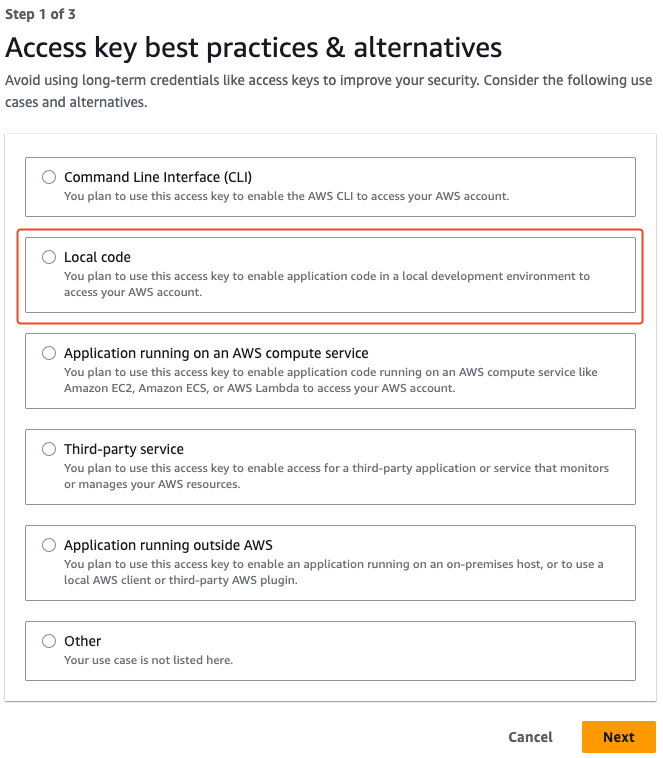
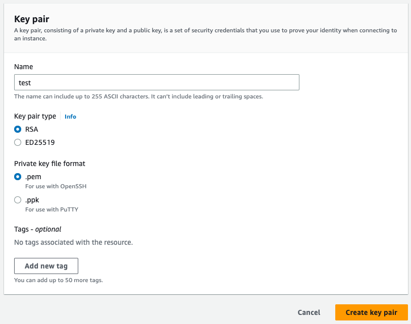

# Terraform

## What is Terraform ?

Terraform is an infrastructure as code tool that lets you build, change, and version cloud and on-prem resources safely and efficiently.

### How does it works ?

Terraform creates and manages resources on cloud platforms and other services through their application programming interfaces (APIs). Providers enable Terraform to work with virtually any platform or service with an accessible API.

The core Terraform workflow consists of three stages:

- Write: You define resources, which may be across multiple cloud providers and services. For example, you might create a configuration to deploy an application on virtual machines in a Virtual Private Cloud (VPC) network with security groups and a load balancer.

- Plan: Terraform creates an execution plan describing the infrastructure it will create, update, or destroy based on the existing infrastructure and your configuration.

- Apply: On approval, Terraform performs the proposed operations in the correct order, respecting any resource dependencies. For example, if you update the properties of a VPC and change the number of virtual machines in that VPC, Terraform will recreate the VPC before scaling the virtual machines.


## Installation

### Ubuntu/Debian

Add keys

```bash
wget -O- https://apt.releases.hashicorp.com/gpg | sudo gpg --dearmor -o /usr/share/keyrings/hashicorp-archive-keyring.gpg
```

Add repo list

```bash
echo "deb [signed-by=/usr/share/keyrings/hashicorp-archive-keyring.gpg] https://apt.releases.hashicorp.com $(lsb_release -cs) main" | sudo tee /etc/apt/sources.list.d/hashicorp.list
```

Update and install

```bash
sudo apt update && sudo apt install terraform
```

## Syntaxe

Travaillons sur un fichier ``main.tf``

## Exemple

```bash
output "VAR" {
    value = "Hello World! "
}
```

## tfstate

tfstate file is equivalent as logfile. It keeps state**S**

### Test & Apply

### Test

```bash
terraform plan
```

### Apply

```bash
terraform apply
```

### Graph

```terraform
terraform graph | dot -Tsvg > graph.svg
```

Example :


## Providers

### AWS

#### Prerequisites

#### IAM

Keys :





!!! WARNING

    Copy somewhere your keys


Generate keys :




Create instance :

Example `main.tf`

- key name = key pairs

```terraform
provider "aws" {
  region     = "eu-central-1"
  access_key = "*************"
  secret_key = "*******************"
}

resource "aws_instance" "test_ec2" {
  ami           = "ami-0ec7f9846da6b0f61" # Ubuntu Server 22.04 LTS (HVM)
  instance_type = "t2.micro"
  key_name      = "***********"

  tags = {
    Name = "test01"
  }
}
```
