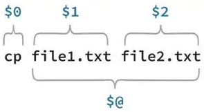

# Getops

getopts processes the positional [parameters](#positional-parameters) of the parent command. In bash, this is stored in the shell variable "$@".

## Positional parameters

A positional parameter is an argument specified on the command line, used to launch the current process in a shell.

Positional parameter values are stored in a special set of variables maintained by the shell.



```bash
mycmd -a argument1 -b argument2
```

## EXAMPLES

The following code fragment shows how one might process the arguments for a command that can take the options -a and -b, and the option -o, which requires an argument.

```bash
args=`getopt abo: $*`
# you should not use `getopt abo: "$@"` since that would parse
# the arguments differently from what the set command below does.
if [ $? -ne 0 ]; then
        echo 'Usage: ...'
        exit 2
fi
set -- $args
# You cannot use the set command with a backquoted getopt directly,
# since the exit code from getopt would be shadowed by those of set,
# which is zero by definition.
while :; do
        case "$1" in
        -a|-b)
                echo "flag $1 set"; sflags="${1#-}$sflags"
                shift
                ;;
        -o)
                echo "oarg is '$2'"; oarg="$2"
                shift; shift
                ;;
        --)
                shift; break
                ;;
        esac
done
echo "single-char flags: '$sflags'"
echo "oarg is '$oarg'"
```
