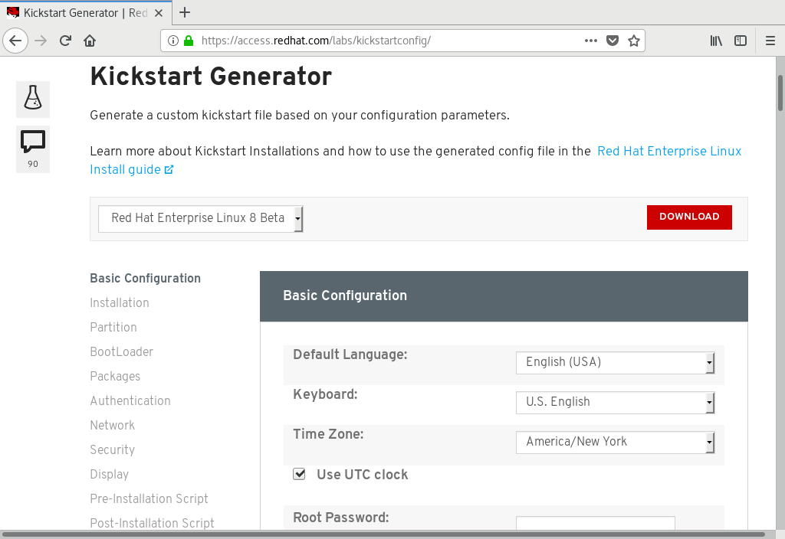
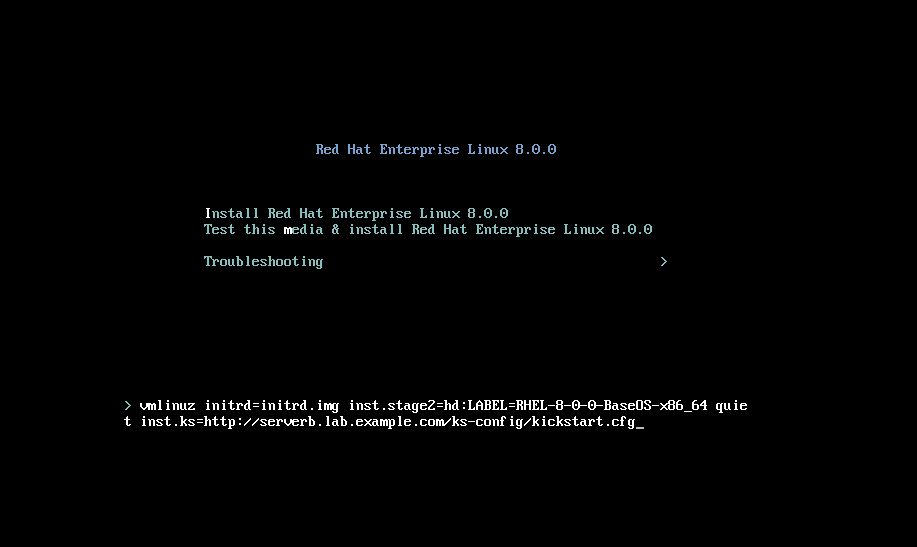

# Kickstart File Commands

## Installation Commands

Define the installation source and how to perform the installation. Each is followed by an example.

* url: Specifies the URL pointing to the installation media.

```shell
url --url="http://classroom.example.com/content/rhel8.2/x86_64/dvd/"
```

* repo: **Specifies where to find additional packages for installation**.

This option must point to a valid **yum** repository.

```shell
    repo --name="appstream" --baseurl=http://classroom.example.com/content/rhel8.2/x86_64/dvd/AppStream/
```

* text: Forces a text mode install.

* vnc: Allows the graphical installation to be viewed remotely over VNC.

```shell
vnc --password=redhat
```

## Partitioning Commands

Define the devices and partitioning scheme to be used.

* clearpart: Removes partitions from the system prior to creation of new partitions.

By default, no partitions are removed.

```shell
clearpart --all --drives=sda,sdb --initlabel
```

* part: Specifies the size, format, and name of a partition.

```shell
part /home --fstype=ext4 --label=homes --size=4096 --maxsize=8192 --grow
```

* autopart: Automatically creates a **root** partition, a swap partition, and an appropriate boot partition for the architecture. 

On large enough drives, this also creates a **/home** partition.

* ignoredisk: Controls Anaconda's access to disks attached to the system.

```shell
ignoredisk --drives=sdc
```

* bootloader: Defines where to install the bootloader.

```shell
bootloader --location=mbr --boot-drive=sda
```

* volgroup, logvol: Creates LVM volume groups and logical volumes.

```shell
    part pv.01 --size=8192
    volgroup myvg pv.01
    logvol / --vgname=myvg --fstype=xfs --size=2048 --name=rootvol --grow
    logvol /var --vgname=myvg --fstype=xfs --size=4096 --name=varvol
```

* zerombr: Initialize disks whose formatting is unrecognized.

## Network Commands

Define the network features used by the host.

* network: Configures network information for target system. 

Activates network devices in installer environment.

```shell
network --device=eth0 --bootproto=dhcp
```

* firewall: Defines the firewall configuration for the target system.

    firewall --enabled --service=ssh,http

Location and Security Commands

Configure settings related to security, language, and regions.

* lang: Sets the language to use during installation and the default language of the installed system. Required.

```shell
    lang en_US.UTF-8
```

* keyboard: Sets the system keyboard type. Required.

```shell
    keyboard --vckeymap=us --xlayouts=''
```

* timezone: Defines the timezone, NTP servers, and whether the hardware clock uses UTC.

```shell
timezone --utc --ntpservers=time.example.com Europe/Amsterdam
```

* authselect: Sets up authentication options.

Options recognized by authselect are valid for this command.

* rootpw: Defines the initial root password.

```shell
rootpw --plaintext redhat

or

rootpw --iscrypted $6$KUnFfrTzO8jv.PiH$YlBbOtXBkWzoMuRfb0.SpbQ....XDR1UuchoMG1
```

* selinux: Sets the SELinux mode for the installed system.

```shell
    selinux --enforcing
```

* services: Modifies the default set of services to run under the default systemd target.

```shell
    services --disabled=network,iptables,ip6tables --enabled=NetworkManager,firewalld
```

* group, user: Create a local group or user on the system.

```shell
    group --name=admins --gid=10001
    user --name=jdoe --gecos="John Doe" --groups=admins --password=changeme --plaintext
```

## Miscellaneous Commands

Configure miscellaneous items related to logging during the installation and the host power state at completion.

* logging: This command defines how Anaconda will perform logging during the installation.

```shell
    logging --host=loghost.example.com --level=info
```

* firstboot: If enabled, the Setup Agent starts the first time the system boots.

The initial-setup package must be installed.

```shell
    firstboot --disabled
```

* reboot, poweroff, halt: Specify the final action to take when the installation completes.

!!! note "Info"
    The ksverdiff utility from the pykickstart package is useful for identifying changes in Kickstart file syntax between two versions of Red Hat Enterprise Linux or Fedora.

For example, ksverdiff -f RHEL7 -t RHEL8 identifies changes in syntax from RHEL 7 to RHEL 8. Available versions are listed in the top of the file /usr/lib/python3.6/site-packages/pykickstart/version.py.

### Example Kickstart File

The first part of the file consists of the installation commands, such as disk partitioning and installation source.

```shell
#version=RHEL8
ignoredisk --only-use=vda
# System bootloader configuration
bootloader --append="console=ttyS0 console=ttyS0,115200n8 no_timer_check net.ifnames=0  crashkernel=auto" --location=mbr --timeout=1 --boot-drive=vda
# Clear the Master Boot Record
zerombr
# Partition clearing information
clearpart --all --initlabel
# Use text mode install
text
repo --name="appstream" --baseurl=http://classroom.example.com/content/rhel8.2/x86_64/dvd/AppStream/
# Use network installation
url --url="http://classroom.example.com/content/rhel8.2/x86_64/dvd/"
# Keyboard layouts
# old format: keyboard us
# new format:
keyboard --vckeymap=us --xlayouts=''
# System language
lang en_US.UTF-8
# Root password
rootpw --plaintext redhat
# System authorization information
auth --enableshadow --passalgo=sha512
# SELinux configuration
selinux --enforcing
firstboot --disable
# Do not configure the X Window System
skipx
# System services
services --disabled="kdump,rhsmcertd" --enabled="sshd,rngd,chronyd"
# System timezone
timezone America/New_York --isUtc
# Disk partitioning information
part / --fstype="xfs" --ondisk=vda --size=10000
```

The second part contains the %packages section, detailing which packages and package groups should be installed, and which packages should not be installed.

```shell
%packages
@core
chrony
cloud-init
dracut-config-generic
dracut-norescue
firewalld
grub2
kernel
rsync
tar
-plymouth

%end
```

The last part contains any %pre and %post installation scripts.

```shell
%post --erroronfail

# For cloud images, 'eth0' _is_ the predictable device name, since
# we don't want to be tied to specific virtual (!) hardware
rm -f /etc/udev/rules.d/70*
ln -s /dev/null /etc/udev/rules.d/80-net-name-slot.rules

# simple eth0 config, again not hard-coded to the build hardware
cat > /etc/sysconfig/network-scripts/ifcfg-eth0 << EOF
DEVICE="eth0"
BOOTPROTO="dhcp"
ONBOOT="yes"
TYPE="Ethernet"
USERCTL="yes"
PEERDNS="yes"
IPV6INIT="no"
EOF

%end
```

## Creating a Kickstart File

Use either of these methods to create a Kickstart file:

* Use the Kickstart Generator website.
* Use a text editor.

The Kickstart Generator website at https://access.redhat.com/labs/kickstartconfig/ presents dialog boxes for user inputs, and creates a Kickstart directives text file with the user's choices. Each dialog box corresponds to the configurable items in the Anaconda installer.


Creating a Kickstart file from scratch is typically too complex, but editing an existing Kickstart file is common and useful. Every installation creates a _/root/anaconda-ks.cfg_ file containing the Kickstart directives used in the installation.

This file makes a good starting point when creating Kickstart file manually.

**ksvalidator** is a utility that checks for syntax errors in a Kickstart file. It ensures that keywords and options are properly used, but it does not validate that URL paths, individual packages, or groups, nor any part of %post or %pre scripts will succeed. 

For instance, if the firewall **--disabled** directive is misspelled, ksvalidator could produce one of the following errors:

```shell
[user@host ~]$ ksvalidator /tmp/anaconda-ks.cfg
The following problem occurred on line 10 of the kickstart file:

Unknown command: frewall

[user@host ~]$ ksvalidator /tmp/anaconda-ks.cfg
The following problem occurred on line 10 of the kickstart file:

no such option: --dsabled
````

The pykickstart package provides ksvalidator.

## Publish the Kickstart File to Anaconda

Make the Kickstart file available to the installer by placing it in one of these locations:

* A network server available at install time using FTP, HTTP, or NFS.
* An available USB disk or CD-ROM.
* A local hard disk on the system to be installed. 

The installer must access the Kickstart file to begin an automated installation. The most common automation method uses a network server such as an FTP, web, or NFS server. Network servers facilitate Kickstart file maintenance because changes can be made once, and then immediately used for multiple future installations.

Providing Kickstart files on USB or CD-ROM is also convenient. The Kickstart file can be embedded on the boot media used to start the installation. However, when the Kickstart file is changed, you must generate new installation media.

Providing the Kickstart file on a local disk allows you to quickly rebuild a system.
Boot Anaconda and Point it to the Kickstart File

Once a Kickstart method is chosen, the installer is told where to locate the Kickstart file by passing the inst.ks=LOCATION parameter to the installation kernel. Some examples:

* inst.ks=`http://server/dir/file`
* inst.ks=`ftp://server/dir/file`
* inst.ks=`nfs:server:/dir/file`
* inst.ks=`hd:device:/dir/file`
* inst.ks=`cdrom:device`



For virtual machine installations using the Virtual Machine Manager or virt-manager, the Kickstart URL can be specified in a box under URL Options. When installing physical machines, boot using installation media and press the Tab key to interrupt the boot process. Add an inst.ks=LOCATION parameter to the installation kernel.

## Reference

* [Red Hat System Administration II](https://rol.redhat.com/rol/app/courses/rh134-8.2/pages/ch12s03)
