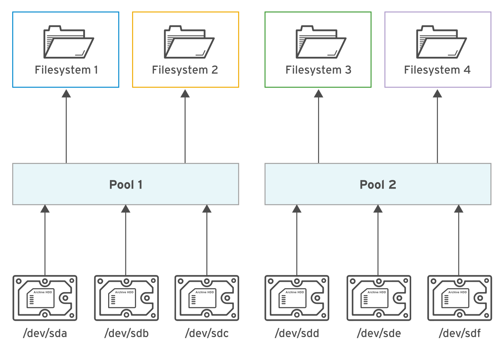

# Describing the Architecture of Stratis

Stratis is a new local storage-management solution for Linux. Stratis is designed to make it easier to perform initial configuration of storage, make changes to the storage configuration, and use advanced storage features.

Stratis runs as a service that manages pools of physical storage devices and transparently creates and manages volumes for the newly created file systems.

In Stratis, file systems are built from shared **pools** of _disk devices_ using a concept known as thin provisioning.

You can create multiple pools from different storage devices. From each pool, you can create one or more file systems. Currently, you can create up to 224 file systems per pool.

The components that make up a Stratis-managed file system are built from standard Linux components. Internally, Stratis is implemented using the Device Mapper infrastructure that is also used to implement _LVM_, and Stratis-managed file systems are formatted using **XFS**.

The following diagram illustrates how the elements of the Stratis storage management solution are assembled. Block storage devices such as hard disks or SSDs are assigned to pools, each contributing some physical storage to the pool. File systems are created from the pools, and physical storage is mapped to each file system as it is needed.



## Working with Stratis Storage

To manage file systems with the Stratis storage management solution, install theses packages :

* stratis-cli
* stratisd packages

The **stratis-cli** package provides the stratis command, which sends reconfiguration requests to the stratisd system daemon.

The **stratisd** package provides the stratisd service, which handles reconfiguration requests and manages and monitors block devices, pools, and file systems that Stratis uses.

## Installing and Enabling Stratis

To use Stratis, make sure that the software is installed and the stratisd service is running.

* Install stratis-cli and stratisd using the yum install command

```shell
[root@host ~]# yum install stratis-cli stratisd
...output omitted...
Is this ok [y/N]: y
...output omitted...
Complete!
```

* Activate the stratisd service using the systemctl command.

```shell
[root@host ~]# systemctl enable --now stratisd
```

## Assembling Block Storage into Stratis Pools

The following are common management operations performed using the Stratis storage management solution.

* Create pools of one or more block devices using the stratis pool create command.

```shell
[root@host ~]# stratis pool create pool1 /dev/vdb
```

Each pool is a subdirectory under the **/stratis** directory.

* Use the stratis pool list command to view the list of available pools.

```shell
[root@host ~]# stratis pool list
Name     Total Physical Size  Total Physical Used
pool1                  5 GiB               52 MiB
```

⚠️ Warning
    The stratis pool list command is very important because it shows you how much storage space is in use (and therefore how much is still available) in the pools.
    If a pool runs out of storage, further data written to file systems belonging to that pool is quietly lost.

* Use the stratis pool add-data command to add additional block devices to a pool.

```shell
[root@host ~]# stratis pool add-data pool1 /dev/vdc
```

* Use the stratis blockdev list command to view the block devices of a pool.

```shell
[root@host ~]# stratis blockdev list pool1
Pool Name  Device Node    Physical Size   State  Tier
pool1      /dev/vdb               5 GiB  In-use  Data
pool1      /dev/vdc               5 GiB  In-use  Data
```

## Managing Stratis File Systems

* Use the stratis filesystem create command to create a file system from a pool.

```shell
[root@host ~]# stratis filesystem create pool1 fs1
```

The links to the Stratis file systems are in the /stratis/pool1 directory.

* Use the stratis filesystem list command to view the list of available file systems.

```shell
[root@host ~]# stratis filesystem list
Pool Name  Name  Used     Created            Device              UUID
pool1      fs1   546 MiB  Sep 23 2020 13:11  /stratis/pool1/fs1  31b9363badd...
```

Use stratis pool list to monitor the remaining real storage available to the Stratis pools.

* You can create a snapshot of a Stratis-managed file system with the stratis filesystem snapshot command

Snapshots are independent of the source file systems.

```shell
[root@host ~]# stratis filesystem snapshot pool1 fs1 snapshot1
```

## Persistently Mounting Stratis File Systems

To ensure that the Stratis file systems are persistently mounted, edit **/etc/fstab** and specify the details of the file system.

The following command displays the **UUID** of the file system that you should use in /etc/fstab to identify the file system.

```shell
[root@host ~]# lsblk --output=UUID /stratis/pool1/fs1
UUID
31b9363.................478c55
```

The following is an example entry in the /etc/fstab file to persistently mount a Stratis file system. This example entry is a single long line in the file.

```shell
UUID=31b9363b-add8-4b46-a4bf-c199cd478c55 /dir1 xfs defaults,x-systemd.requires=stratisd.service 0 0
```

The `x-systemd.requires=stratisd.service` mount option **delays** mounting the file system until after systemd starts the stratisd.service during the boot process.

---

## References

* [Red Hat System Administration II](https://rol.redhat.com/rol/app/courses/rh134-8.2/pages/ch08)
