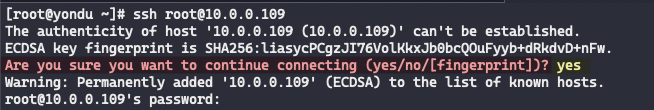

# Remote Connection

## SSH

### Proxy settings

Into my ssh configuration file, I added the nc command like :

```shell
ProxyCommand /usr/bin/nc -x $PROXY_iP %h %p
```

As Example :

```shell
## Customer
Host customer1
    Hostname 1**.**.***.*0
    User toto
    ProxyCommand /usr/bin/nc -x $PROXY_iP %h %p
```

### sshs

sshs is kind of bastion based on ssh config file

```zsh
brew install sshs
```


Repository link : [https://github.com/quantumsheep/sshs](https://github.com/quantumsheep/sshs
)

### sshpass

How to let easier your life

* First, install-it with [homebrew](#homebrew) if it dont installed yet.

```zsh
/bin/bash -c "$(curl -fsSL https://raw.githubusercontent.com/Homebrew/install/HEAD/install.sh)"
```

* Next, install sshpass

```zsh
brew install hudochenkov/sshpass/sshpass
```

* Then, use it dude

```zsh
sshpass -f LOCAIONT/FILENAME ssh user@iP
```

#### fingerprint

ℹ️ Don't forget you need to accept the remote fingerprint before any sshpass connection



## RDP

### Royal TSX

I personaly use Royal TSX, and didn't find better for the moment

[https://royaltsx-v5.royalapps.com/updates/royaltsx_5.1.2.1000.dmg](https://royaltsx-v5.royalapps.com/updates/royaltsx_5.1.2.1000.dmg)