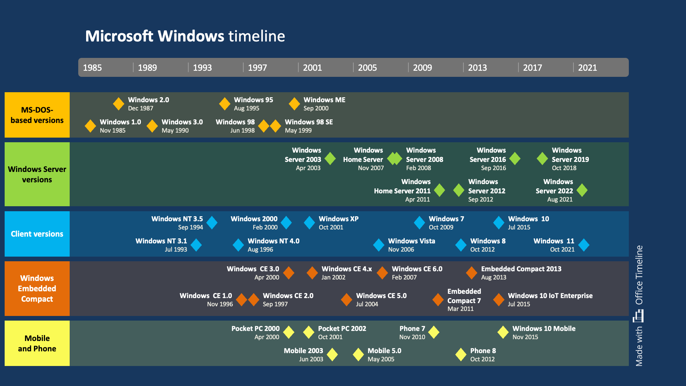

# README

Windows is a **group of several proprietary graphical operating system** families *developed and marketed by Microsoft*. Each family caters to a certain sector of the computing industry.  
For example, Windows NT for consumers, Windows Server for servers, and Windows IoT for embedded systems.  
Defunct Windows families include Windows 9x, Windows Mobile, and Windows Phone.
